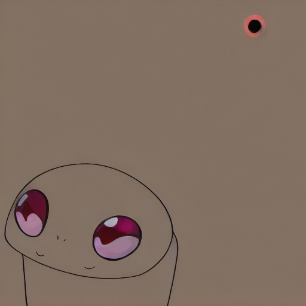

# 🎨 Pokémon Stable Diffusion Fine-Tuning

Fine-tuned Stable Diffusion model for generating Pokémon characters in anime style. This project fine-tunes Stable Diffusion v1.5 on 35K Pokémon images with LoRA adapters for efficient training.

### Generated Image



## 🌟 Quick Links

### 🔗 Important Links
- **🎯 Fine-tuned Model**: [Kaggle Model](https://www.kaggle.com/models/haradibots/stable-diffusion-v1-finetuned/PyTorch/default/1/)
- **📊 Dataset**: [35K Pokémon Dataset](https://www.kaggle.com/datasets/saranga7/35k-pokemon-and-text-descriptions/versions/1)
- **📓 Training Notebook**: [Kaggle Notebook](https://www.kaggle.com/code/haradibots/bkl-new-way-to-work-what-1/edit/run/290183288)

### 👨‍💻 Author Links
- **LinkedIn**: [Aditya Haradibots](https://www.linkedin.com/in/aditya-haradibots/)
- **Instagram**: [@haradibots](https://www.instagram.com/haradibots/)
- **Kaggle**: [haradibots](https://www.kaggle.com/code/haradibots/)

## 🚀 Quick Start

### Installation
```bash
# Clone the repository
git clone https://github.com/yourusername/pokemon-stable-diffusion-finetuning.git
cd pokemon-stable-diffusion-finetuning

# Install dependencies
pip install -r requirements.txt
```

### Inference (Generate Images)
```python
from inference import PokemonGenerator

# Load the fine-tuned model
generator = PokemonGenerator("models/offline_model_epoch_4")

# Generate a Pokémon image
image = generator.generate(
    "cute electric pokemon, anime style, soft lighting",
    num_inference_steps=30,
    guidance_scale=7.5
)
image.save("my_pokemon.png")
```

### Training
```python
# Train the model (requires GPU)
python train.py --epochs 5 --batch-size 32
```

## 📁 Project Structure
```
pokemon-stable-diffusion-finetuning/
├── train.py              # Training script
├── inference.py          # Inference/generation script
├── requirements.txt      # Python dependencies
├── outputs/              # Generated images
│   └── offline_result.png
├── models/               # Model checkpoints
└── data/                # Dataset information
```

## 🎯 Features

- ✅ Fine-tuned Stable Diffusion v1.5 on 35K Pokémon dataset
- ✅ LoRA adapters for efficient training (rank 16)
- ✅ Anime-style Pokémon generation
- ✅ Custom tokenizer and text encoder
- ✅ Multiple checkpoint saves during training
- ✅ Clean data preprocessing pipeline

## 📊 Model Details

### Architecture
- **Base Model**: Stable Diffusion v1.5
- **Fine-tuning Method**: LoRA (Low-Rank Adaptation)
- **LoRA Rank**: 16
- **Target Modules**: to_q, to_k, to_v, to_out.0
- **Precision**: FP16/BF16 mixed precision

### Training Specifications
| Parameter | Value |
|-----------|-------|
| **Epochs** | 5 |
| **Batch Size** | 32 |
| **Learning Rate** | 1e-5 |
| **Image Size** | 512×512 |
| **Dataset Size** | ~30K cleaned pairs |
| **Training Time** | ~4-6 hours (Kaggle P100) |

## 📈 Example Outputs

### Generated Image

*Prompt: "cute electric pokemon, anime style, soft lighting"*

### More Generation Examples
```python
# Fire type Pokémon
image = generator.generate(
    "fire type pokemon, battle pose, dramatic lighting",
    num_inference_steps=50,
    guidance_scale=8.0
)

# Water type Pokémon
image = generator.generate(
    "water pokemon swimming in ocean, fantasy art style",
    negative_prompt="blurry, distorted",
    height=768,
    width=768
)
```

## 🛠️ Training Process

### Data Preparation
1. **Loading**: 35K Pokémon images with text descriptions
2. **Cleaning**:
   - Convert captions to lowercase
   - Remove special characters
   - Filter short captions (<3 words)
3. **Preprocessing**:
   - Resize to 512×512
   - Center crop
   - Normalize to [-1, 1]

### Model Setup
```python
# Load base model
pipe = StableDiffusionPipeline.from_pretrained(
    "runwayml/stable-diffusion-v1-5",
    torch_dtype=torch.bfloat16,
    safety_checker=None
)

# Add LoRA adapters
lora_config = LoraConfig(
    r=16,
    lora_alpha=32,
    target_modules=["to_q", "to_k", "to_v", "to_out.0"],
    lora_dropout=0.1,
    bias="none"
)
pipe.unet.add_adapter(lora_config)
```

### Training Loop
- **Frozen Components**: VAE, Text Encoder
- **Trainable**: UNet with LoRA adapters
- **Loss**: Mean Squared Error (MSE) on noise prediction
- **Scheduler**: DDPM (Denoising Diffusion Probabilistic Models)

## 💾 Model Checkpoints

Checkpoints saved after each epoch:
- `offline_model_epoch_0/` - After 1 epoch
- `offline_model_epoch_1/` - After 2 epochs
- `offline_model_epoch_2/` - After 3 epochs
- `offline_model_epoch_3/` - After 4 epochs
- `offline_model_epoch_4/` - Final model (after 5 epochs)

Each checkpoint includes:
1. **UNet weights** (with LoRA adapters)
2. **VAE weights** (frozen)
3. **Text Encoder** (frozen)
4. **Scheduler configuration**
5. **Tokenizer** (custom)

## 🔧 Usage Examples

### Basic Generation
```python
from inference import PokemonGenerator

# Initialize generator
generator = PokemonGenerator(
    model_path="models/offline_model_epoch_4",
    device="cuda"  # or "cpu"
)

# Generate image
image = generator.generate(
    prompt="cute electric pokemon, anime style, soft lighting",
    num_inference_steps=30,
    guidance_scale=7.5
)
```

### Advanced Options
```python
image = generator.generate(
    prompt="fire type pokemon, battle pose",
    negative_prompt="blurry, distorted, ugly, deformed",
    num_inference_steps=50,
    guidance_scale=8.0,
    height=768,
    width=768,
    seed=42  # For reproducibility
)
```

### Command Line Interface
```bash
# Generate with default settings
python inference.py --prompt "cute electric pokemon"

# Custom parameters
python inference.py \
    --prompt "mystical water pokemon" \
    --steps 50 \
    --guidance-scale 8.0 \
    --negative-prompt "blurry, distorted" \
    --output-path "water_pokemon.png" \
    --display
```

## 📦 Requirements

### Core Dependencies
```txt
torch>=2.0.0
diffusers>=0.21.0
transformers>=4.35.0
accelerate>=0.24.0
peft>=0.6.0
```

### Complete Requirements
See `requirements.txt` for full list.

## ⚙️ Hardware Requirements

| Component | Minimum | Recommended |
|-----------|---------|-------------|
| **GPU** | NVIDIA 8GB VRAM | NVIDIA 16GB+ VRAM |
| **RAM** | 16GB | 32GB |
| **Storage** | 10GB | 20GB+ |
| **CPU** | 4 cores | 8+ cores |

## 📝 Code Examples

### Training Script
```python
python train.py \
    --data-dir "clean_data" \
    --output-dir "models" \
    --epochs 5 \
    --batch-size 32 \
    --learning-rate 1e-5 \
    --lora-rank 16 \
    --device cuda
```

### Custom Training
```python
from train import PokemonTrainer

config = {
    "model_id": "runwayml/stable-diffusion-v1-5",
    "data_dir": "clean_data",
    "output_dir": "models",
    "epochs": 5,
    "batch_size": 32,
    "learning_rate": 1e-5,
    "lora_rank": 16,
    "device": "cuda"
}

trainer = PokemonTrainer(config)
trainer.train()
```

## 🐛 Known Issues & Limitations

1. **Dataset Bias**: May overfit to common Pokémon types
2. **Style Consistency**: Anime style may vary between generations
3. **Text Alignment**: Captions don't always perfectly match generated images
4. **Resource Intensive**: Requires significant GPU memory
5. **Generation Time**: ~10-30 seconds per image

## 🔮 Future Improvements

- [ ] Add Dreambooth training for specific characters
- [ ] Implement ControlNet for pose control
- [ ] Add textual inversion support
- [ ] Create Gradio web interface
- [ ] Train on larger, more diverse dataset
- [ ] Optimize for mobile deployment
- [ ] Add negative embedding training
- [ ] Implement prompt weighting

## 📊 Performance Metrics

| Metric | Value |
|--------|-------|
| **Training Time** | 4-6 hours (Kaggle P100) |
| **Inference Time** | 10-30 seconds per image |
| **Model Size** | ~7GB (total) |
| **VRAM Usage** | 4-8GB during inference |
| **Memory Usage** | 8-12GB during training |

## 👥 Contributing

Contributions are welcome! Please follow these steps:

1. Fork the repository
2. Create a feature branch (`git checkout -b feature/AmazingFeature`)
3. Commit your changes (`git commit -m 'Add AmazingFeature'`)
4. Push to the branch (`git push origin feature/AmazingFeature`)
5. Open a Pull Request

### Contribution Guidelines
- Follow PEP 8 style guide
- Add docstrings to new functions
- Update documentation as needed
- Include tests for new features

## 📄 License

This project is for educational and research purposes. Model weights are based on Stable Diffusion which has its own licensing terms. Please review the original model licenses before commercial use.

- **Stable Diffusion License**: [Hugging Face](https://huggingface.co/spaces/CompVis/stable-diffusion-license)
- **Dataset License**: Check Kaggle dataset page

## 🙏 Acknowledgments

- **Stability AI** for Stable Diffusion
- **Hugging Face** for Diffusers library
- **Kaggle** for computing resources and dataset
- **LoRA authors** for efficient fine-tuning method
- **Pokémon dataset contributors**

## 📚 References

1. Stable Diffusion: [Paper](https://arxiv.org/abs/2112.10752)
2. LoRA: [Paper](https://arxiv.org/abs/2106.09685)
3. Diffusers Library: [GitHub](https://github.com/huggingface/diffusers)
4. PEFT Library: [GitHub](https://github.com/huggingface/peft)

## 🆘 Support

For issues and questions:
1. Check [Issues](https://github.com/yourusername/pokemon-stable-diffusion-finetuning/issues)
2. Review Kaggle [Discussion](https://www.kaggle.com/datasets/saranga7/35k-pokemon-and-text-descriptions/discussion)
3. Contact via LinkedIn or Kaggle

## 📞 Contact

**Haradibots**
- LinkedIn: [Aditya Haradibots](https://www.linkedin.com/in/aditya-haradibots/)
- Instagram: [@haradibots](https://www.instagram.com/haradibots/)
- Kaggle: [haradibots](https://www.kaggle.com/code/haradibots/)
- Email: [Your Email]

---

⭐ **If you find this project useful, please give it a star on GitHub!** ⭐

**Happy Pokémon generating!** 🎨🔥🌊⚡# Stable-diffusion-V1-finetuned-

